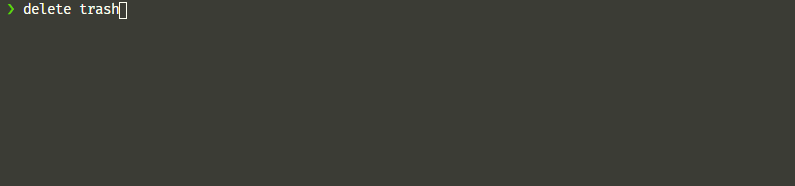
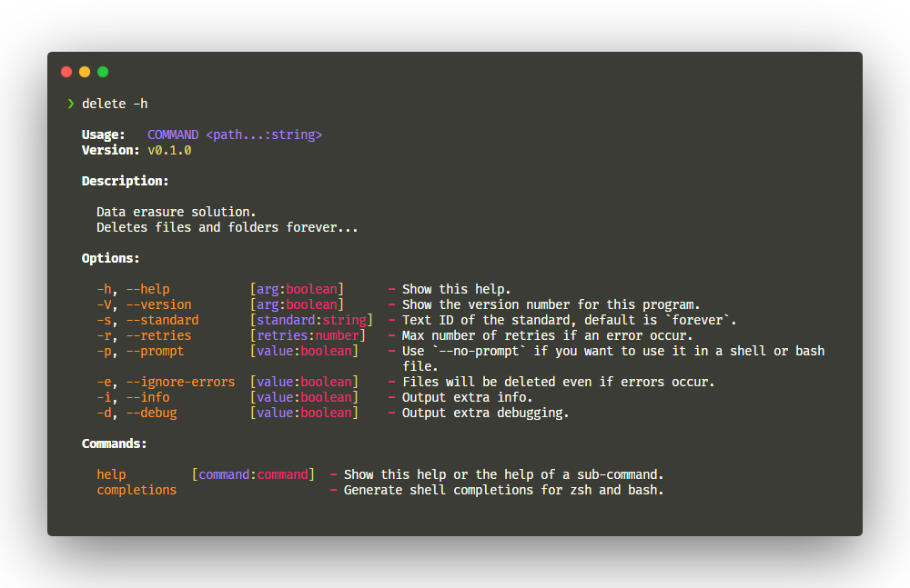

<h1 align="center">
  
  <br>
  <strong>Remove forever</strong>
  <br>
</h1>
<p align="center">Data erasure solution for files on deno 🦕</p>

## ❓ Why

When you delete a file using the `rm` UNIX command or with any software, it only removes direct pointers to the data disk sectors and make the data recovery possible with common software tools.

Permanent data erasure goes beyond basic file deletion commands, which:

1. Allow for selection of a specific standard, based on unique needs,
2. Verify the overwriting method has been successful and removed data across the entire device.

## 🔩 How It Works

The basic principle is to write files before deletion in order to make recovery harder. With remove-forever, you get to choose the standard that follow your needs. Each one is composed of instructions about how many passes it should perform.

It goes from a simple pass of zeros to a 35 passes algorithm. Remove-forever comes with its own algorithm to ensure your data is safe:

* A pass of cryptographically strong pseudo-random data,
* The file is then renamed,
* Truncated to hide the file size.
* And finally files timestamps are randomized.

## ✨ Features

Remove-forever is composed of two parts: a deno module with a straightforward API and a command line interface optimized to delete files on the fly.


* [Choose your standard](#)
* [Create your own standard](#)
  * [on files](#)
  * [on directories](#)
* [Wipe disk (TODO)](#)

<!-- ### 📚 [Documentation]() -->

## 📦 CLI Installation

[Deno](https://deno.land/#installation) required.

```shell
deno install --allow-write --allow-read --unstable -n remove https://deno.land/x/remove_forever/cli.ts
```
> **Note**: Due to the use of `Deno.utime` and the confirmation request in the CLI, you will need to use the `--unstable` flag.

## 🚀 Quick Start

If you want your application to delete specific files with a pass of cryptographically strong pseudo-random data, use one of these code snippets:

```ts
import remove from "https://deno.land/x/remove_forever/mod.ts";

await remove("./trash")
await remove("./vault/secret.txt")
```

## 📋 Examples

```ts
import { remove, fileStandards, directoryStandards } from "./mod.ts";

const count = await remove("./trash/secret.txt", {
  fileStandard: fileStandards.gutmann.remove,
  directoryStandard: directoryStandards.unsafe.remove,
  ignoreErrors: true,
});

console.log(`Removed ${count} files and folders!`)
```

<br/>
<div align="center">
  
  
</div>

## 📜 Changelog / History

See the [changelog](/CHANGELOG.md) or [releases](https://github.com/oganexon/deno-remove-forever/releases).

## 🧾 Roadmap

See the [open issues](https://github.com/oganexon/deno-remove-forever/issues) and
[project boards](https://github.com/oganexon/deno-remove-forever/projects/) for a list of proposed features (and known issues). 

## 🏗️ Contributing

Contributions are what make the open source community such an amazing place to be learn, inspire, and create. Any contributions you make are **greatly appreciated**.

1. Fork the Project
2. Create your Feature Branch (`git checkout -b feature/AmazingFeature`)
3. Commit your Changes (`git commit -m 'Add some AmazingFeature'`)
4. Make sure that `deno test` and `deno fmt` do not generate errors
5. Push to the Branch (`git push origin feature/AmazingFeature`)
6. Open a Pull Request

### Licensing

Icon library by [Icons8](https://icons8.com/).

This project is under [MIT License](/LICENSE).
